# ⚡ AC-to-DC LED Driver PCB — Five-Channel Infrared LED Driver NOTE : photos under review

<p align="center">
  
</p>

<p align="center">
  
  
  
  
</p>

---

## 📋 Project Overview

This project is a **fully hand-fabricated AC-to-DC regulated power supply** designed to drive **five infrared LEDs** simultaneously. It was developed as part of the Electrical & Electronics Engineering curriculum at **Assiut University**, under the supervision of **Dr. Khalil Ismail**.

The circuit converts a **17 V peak / 50 Hz sinusoidal AC** input into a stable **9.1 V regulated DC output** using a Zener shunt regulator, and distributes ~18.8 mA to each of the five IR LED branches.

---

## 🧩 Circuit Architecture

The circuit is structured as a cascade of four functional stages:

```
AC Input → Full-Wave Bridge Rectifier → Capacitive Filter → Zener Regulator → 5× LED Branches
```

| Stage | Component | Value / Part |
|-------|-----------|-------------|
| AC Input | Terminal Block (TB1) | 2-Pin, 5.08 mm pitch |
| Rectifier | D1–D4 | 1N4007 (×4) |
| Filter | C1 | 2200 µF / 50 V Electrolytic |
| Pre-reg Resistor | R1 | 47 Ω, ≥ 1 W |
| Zener Regulator | D5 | 1N4739A (9.1 V, 1 W) |
| LED Resistors | R2–R6 | 420 Ω, ¼ W (×5) |
| LEDs | LED1–LED5 | Infrared LEDs (Vf ≈ 1.2 V) |

---

## 📐 Key Design Calculations

| Parameter | Value |
|-----------|-------|
| AC Peak Voltage | 17 V |
| AC RMS Voltage | 12.02 V |
| Peak Voltage After Rectifier | 15.6 V |
| Ripple Voltage (p-p) | ~0.2 V |
| Regulated Output (Zener) | 9.1 V |
| Current Through R1 | ~134 mA |
| Zener Current (max) | ~90 mA |
| Zener Power Dissipation (max) | ~0.82 W |
| Current Per LED Branch | ~18.8 mA |
| Total LED Current | ~94 mA |

---

## 🖥️ Step 1 — Schematic Design in LTspice

The circuit was first drawn and simulated in **LTspice** using a `.tran 0.5` transient analysis (500 ms window) to verify rectification, filtering, and regulation behaviour before committing to PCB layout.

<p align="center">
  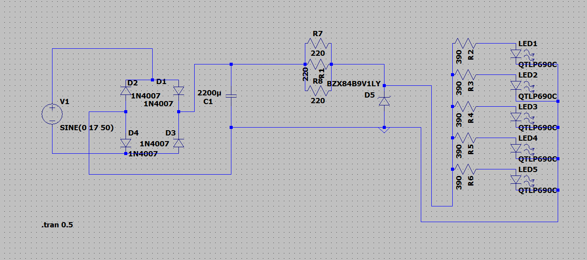
  <br><em>Figure 1 — LTspice Schematic</em>
</p>

### Simulation Waveforms

**Rectified & Filtered DC Voltage (V_cap):**

<p align="center">
  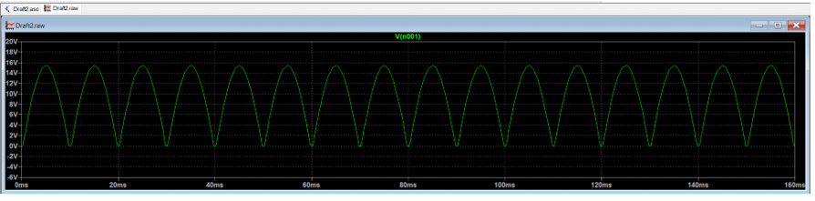
  <br><em>Figure 2 — V_cap: Pulsating DC before regulation (~15.4 V with 0.2 V ripple)</em>
</p>

**Regulated Zener Output (9.1 V):**

<p align="center">
  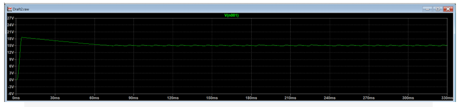
  <br><em>Figure 3 — Stable 9.1 V regulated output</em>
</p>


---

## 🖨️ Step 2 — PCB Design in KiCad

After successful simulation, the schematic was transferred to **KiCad** for PCB layout. Key design decisions included:

- AC input traces routed with **≥ 2 mm creepage/clearance** from DC traces (per IEC 60950)
- Zener diode and R1 placed close together to **minimise high-current trace length**
- LED resistors (R2–R6) arranged in a **symmetrical column** matching LED positions
- Terminal block mounted at **board edge** for direct cable access
- All components on the **top layer**; solder joints on the **bottom layer**

<p align="center">
  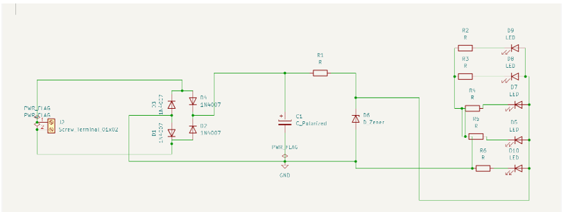
  <br><em>Figure 5 — Schematic captured in KiCad</em>
</p>

<p align="center">
  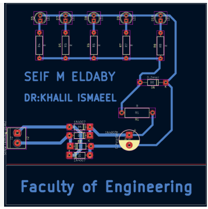
  <br><em>Figure 6 — PCB Top Layer Layout</em>
</p>

<p align="center">
  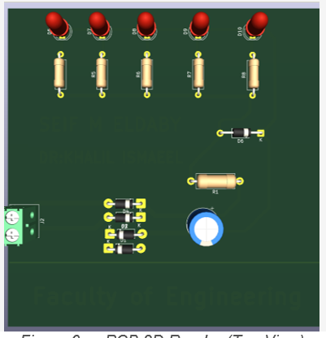
  <br><em>Figure 7 — PCB 3D Render (Top View)</em>
</p>

---

## 🏭 Step 3 — PCB Manual Fabrication

The board was fabricated entirely by hand using the **toner transfer method**. Below is the complete process:

### 3.1 Toner Transfer

The layout was printed on **glossy paper** using a laser printer, then heat-transferred onto the copper-clad board using an iron.

<p align="center">
  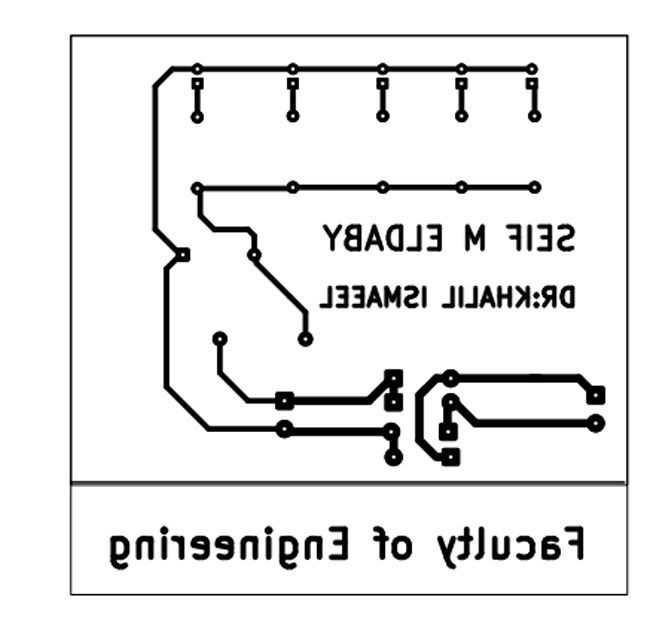
  <br><em>Figure 8 — Toner transferred onto copper-clad board</em>
</p>

### 3.2 Chemical Etching

The board was submerged in **Ferric Chloride (FeCl₃)** solution to dissolve the exposed copper, leaving only the toner-protected traces.

<p align="center">
  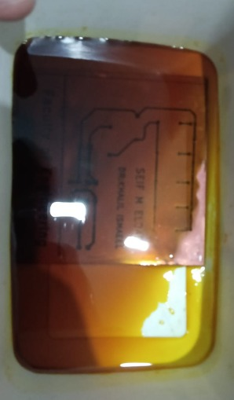
  <br><em>Figure 9 — Board during chemical etching process</em>
</p>
<p align="center">
  
</p>
### 3.3 Cleaning & Inspection

Toner was removed with **Acetone/Thinner** to reveal the copper tracks. A visual inspection was performed to check for shorts or broken traces.

<p align="center">
  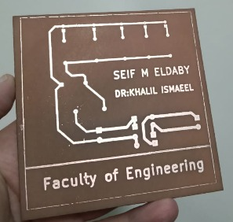
  <br><em>Figure 10 — Board after cleaning, copper traces visible</em>
</p>

### 3.4 Continuity Testing

A **Digital Multimeter** was used to verify electrical integrity of all traces before drilling.

<p align="center">
  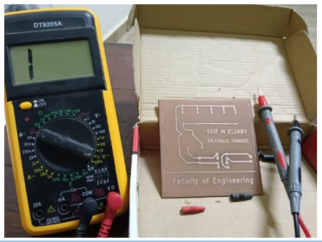
  <br><em>Figure 11 — Continuity testing with DMM</em>
</p>

### 3.5 Drilling

Precision holes were drilled using a **mini drill press** with bit sizes of **0.8 mm – 1.0 mm** depending on component lead diameter.

<p align="center">
  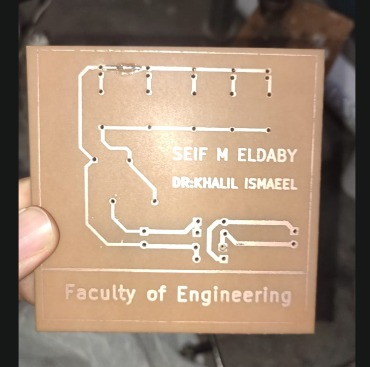
  <br><em>Figure 12 — Drilling through-hole component pads</em>
</p>

### 3.6 Component Assembly & Soldering

Components were placed per the silkscreen layout and soldered using a **temperature-controlled iron** with lead-tin wire, targeting concave solder joints for maximum reliability.
</p>
<p align="center">
  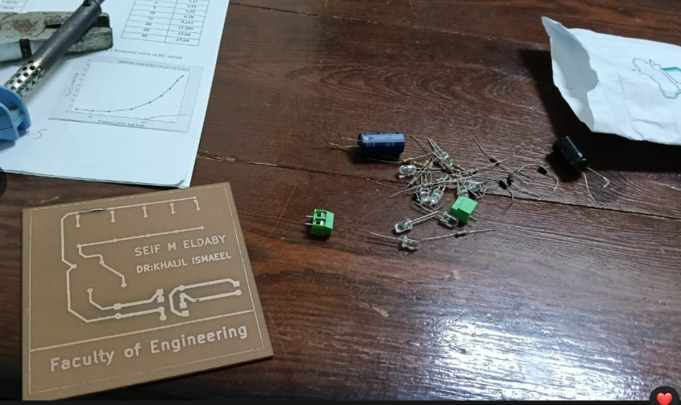
  <br><em>Figure 13 — Components being assempled onto the board</em>
</p>
<p align="center">
  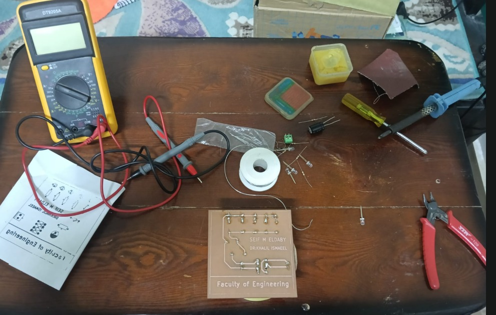
  <br><em>Figure 13 — Components being soldered onto the board</em>
</p>
<p align="center">
  
  <br><em>Figure 13 — Components being soldered onto the board</em>

---

## ✅ Step 4 — Testing & Verification

After assembly, the circuit was powered through a **safety isolation transformer** for the initial power-up. Output voltage and LED branch currents were measured with a multimeter to confirm they met specifications.

<p align="center">
  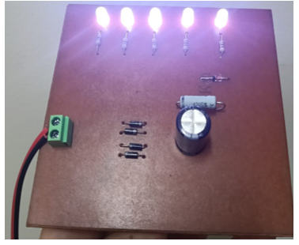
  <br><em>Figure 14 — Measuring output voltage and current </em>
</p>

---

## 🎉 Final Result

The completed board with all five IR LEDs operational:

<p align="center">
  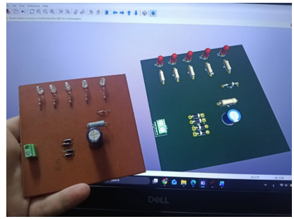
  <br><em>Figure 15 — Final assembled board with LEDs powered on</em>
</p>

The board was then cleaned with **Isopropyl Alcohol (IPA)** to remove flux residues.

---

## 🔬 Results Summary

| Measurement | Expected | Result |
|-------------|----------|--------|
| Regulated Output Voltage | 9.1 V | ✅ 9.1 V |
| LED Branch Current | ~18.8 mA | ✅ Within spec |
| Ripple Voltage | ~0.2 V p-p | ✅ Well-smoothed |
| Zener Power Dissipation | ≤ 1 W | ✅ ~0.82 W max |
| All LEDs Operational | 5/5 | ✅ 5/5 |

---

## 🛠️ Tools Used

| Tool | Purpose |
|------|---------|
| **LTspice** | Circuit simulation & waveform analysis |
| **KiCad** | Schematic capture & PCB layout |
| **Ferric Chloride** | Chemical etching |
| **Soldering Iron** | Component assembly |
| **Digital Multimeter** | Continuity testing & measurements |

---

## 📁 Repository Structure

```
📦 AC-DC-LED-Driver-PCB
 ┣ 📂 images/                  ← All photos and screenshots
 ┣ 📂 ltspice/                 ← LTspice simulation files (.asc, .raw)
 ┣ 📂 kicad/                   ← KiCad project files (.kicad_sch, .kicad_pcb)
 ┣ 📄 README.md                ← This file
 ┗ 📄 LED_Driver_PCB_Report.pdf ← Full technical report
```

---

## 👤 Author

**Seif Elden Mostafa Salah Eldaby**  
Electrical & Electronics Engineering — Assiut University (Class of 2029)  

**Supervisor:** Dr. Khalil Ismail  
Faculty of Engineering — Assiut University

---

## 📄 License

This project is submitted as academic work at Assiut University. Feel free to use it for learning purposes with proper attribution.
